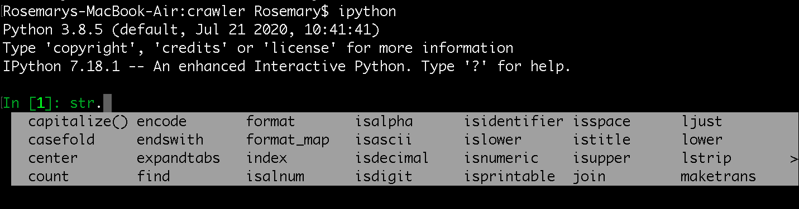
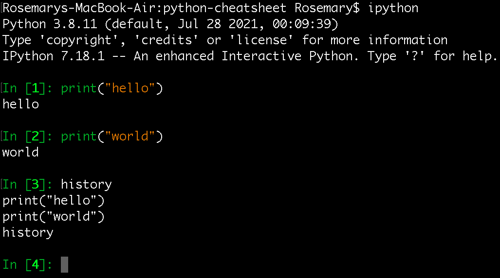
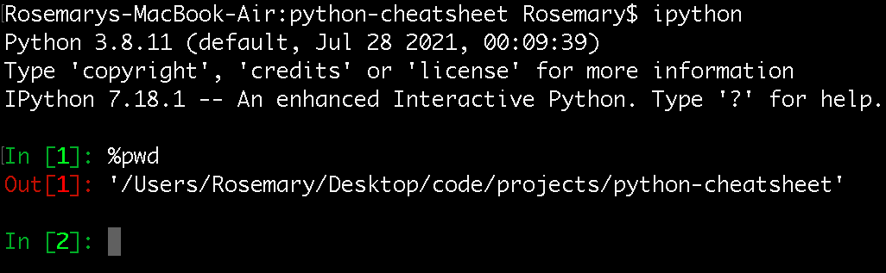

# Python
## Python version
* Mac and many linux distributions installed python (2.7) by default. (That's why python is puplor for automation)  
* Don't change python3 to default in linux, some programs are depending on python2.7 (e.g., node-gyp)
* Python 2.x will be EOS at 2020
* Different version of linux server will have different version of python, to install specific version of python on linux, we need to `wget` and `build` it

## Python [implementation](https://wiki.python.org/moin/PythonImplementations)
In theory, a python script could be run using any of the implementations, and the results of running the script should be the same

* `CPython`
  * The original Python implementation
  * It is the implementation you download from Python.org
  * It implemented in C
* `JPython`
  * Java implementation of python programming language

### Why so many implementations
It is easier to use Java library in JPython

# REPL
A read–eval–print loop (REPL), also termed an `interactive toplevel` or `language shell`, is a simple interactive computer programming environment that takes single user inputs, executes them, and returns the result to the user; a program written in a REPL environment is `executed piecewise`

## ipython
* A better version of interactive Python interpreter
  * autocomplete
  * run command (e.g., `%pwd`)
  * see `history`
* Need to install it first 
  * `pip install ipython` 
* GUI (notebook) support
  * IPython and Jupyter are connected and related





# Virtual environment
```
python3 -m virtualenv my_venv
source my_venv/bin/activate
pip3 install -r requirements.txt
deactivate
```

* It is bad practice to put `virtualenv` into git because there are many paths pointing to the local environment

# Wheel
* It is a built-package format for python
* It is a zip format archive with a specially formatted filename and the .whl extension
* It is intended to replace eggs

## Why wheel
* Faster installation for pure Python and native C extension packages
* Avoids arbitrary code execution for installation (Avoids setup.py)
* Installation of a C extension does not require a compiler on Linux, Windows or macOS
* More consistent installs across platforms and machines
  * Good for CI

https://pythonwheels.com/

# pip
* `pip` is used to replace `easy_install`
* `pip3 freeze > requirements.txt` will generate all the packages you have, even you don't use them in your project
* `pip install some-package.whl` will install package from .whl file directly

## pip.conf
* pip allows you to set all command line option defaults in a standard ini style config file

If multiple configuration files are found by pip then they are combined in the following order:

* The site-wide file is read
* The per-user file is read
* The virtualenv-specific file is read

Each file read overrides any values read from previous files

# twine
* It is a utility for publishing python packages on PyPl

# setup.py
It is a python file, it allows you to install Python packages

```
pip3 install . 
pip3 install -e /path/to/package
```

Running `-e` options installs the package in a way, that you can edit the package, and when a new import call looks for it, it will import the edited package code. This can be very useful for package development.

or 

```
python3 setup.py install
```

pip does run `python setup.py install` when installing your package - it does not change the way your setup.py is executed.

# `-m option`
* The argument is a module name, we should provide module name, not file name. For example:
```
python -m pip install <package>
python3 -m http.server 8888
python3 -m virtualenv venv
```

# python version
* In specific version of python, the old version of the library does not support
```
ERROR: Could not find a version that satisfies the requirement tensorflow==1.15.5 (from versions: 2.2.0rc3, 2.2.0rc4, 2.2.0, 2.2.2, 2.2.3, 2.3.0rc0, 2.3.0rc1, 2.3.0rc2, 2.3.0, 2.3.2, 2.3.3, 2.4.0rc1, 2.4.0rc2, 2.4.0rc3, 2.4.0rc4, 2.4.0, 2.4.1, 2.4.2, 2.5.0rc0, 2.5.0rc1, 2.5.0rc2, 2.5.0rc3, 2.5.0, 2.6.0rc0, 2.6.0rc1)
ERROR: No matching distribution found for tensorflow==1.15.5
```

## Install mutiple version of python3
* we can also use `pyenv` or `conda` to do the same thing
 
### On Mac
* installation
```
brew install python@3.7
brew install python@3.8
```

* `sudo vim ~/.bash_profile` (need to reopen the console)
```
alias python3.7="/usr/local/opt/python@3.7/bin/python3.7"
alias python3.8="/usr/local/opt/python@3.8/bin/python3.8"

alias pip3.7="/usr/local/opt/python@3.7/bin/pip3.7"
alias pip3.8="/usr/local/opt/python@3.8/bin/pip3.8"
```

* virtual environment


# `Too many open files in system` issue
* on mac, we can
```
launchctl limit maxfiles
sudo launchctl limit maxfiles 65536 200000
```

* the command on linux is different

# Ref
https://blog.zengrong.net/post/2169.html
